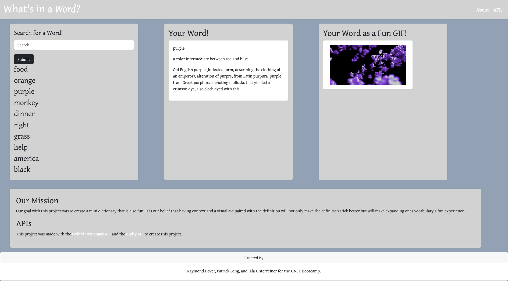

# 07 Group Project 1: Interactive Front-End Application

# What's in a Word?

## Table of Contents

1. [Description](#description)
2. [Resources](#resources)
3. [Visuals](#visuals)
4. [Author and Aknowledgement](#author-and-aknowledgements)

## User Story
AS A user who needs a word defined,

I WANT a dictionary that provides definitions, etymologies, and a visual example,

SO THAT I have a fuller understanding of the words I use and have fun learning new ones. 

## Description

For our group project, we created an application that allows the user to search for a word and receive the definition, etymology, and a gif related to their search. The user’s searches are held in local storage and displayed on the page, and clicking the word will show the results again.We used the Oxford Dictionary API and the Giphy API to create this application.

## Resources

* [Live Site](https://raydover.github.io/project-01/)

* [Repository](https://git@github.com:raydover/project-01.git)

## Visuals

## Authors and Acknowledgements

code created & optimized by UNCC Coding Bootcamp Students - Raymond Dover, Jala Unterreiner and Patrick Long